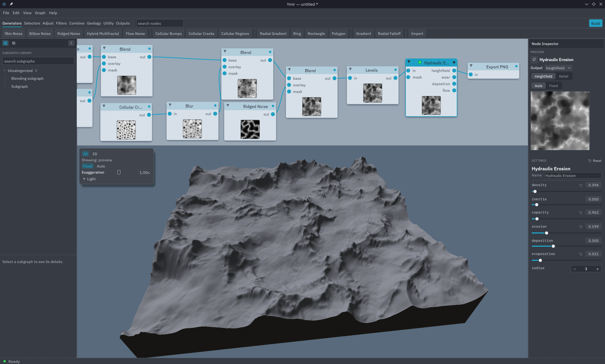

#  Ymir

An open-source, node-based procedural terrain generator for Linux.

Everything is a layered field, and nodes just transform it. You compose terrain
by wiring small, single-purpose nodes into a graph, the way you would in Houdini's
heightfield workflow or in Gaea and World Machine, rather than by configuring one
monolithic tool.

Named for the primordial giant of Norse myth, whose body the world is shaped from.

<!-- Replace with a real screenshot before launch (see docs/images/). -->


## Status

Early and evolving, but real. Ymir already has a working node editor, a 3D terrain
viewport, 32 nodes (noise, shapes, selectors, filters, and three erosion models),
subgraphs, and 16-bit PNG, raw R16, and 32-bit EXR export. Expect rough edges and
changing internals. Feedback and issues are welcome.

It is a personal, non-commercial project, built to a deliberately high bar: the
architecture and code should hold up to scrutiny from experienced Rust developers.

## What is inside

- **One data model.** A single `Field` type flows on every edge: a grid of named
  scalar layers (`height`, `mask`, `flow`, `water`, `sediment`, ...) plus a few
  scalar globals. The engine never needs to know what a node does, so nodes are
  insertable anywhere and the graph has no fixed build order.
- **Many small nodes, not a few big ones.** Generators (fBm, ridged, billow, hybrid,
  flow, cellular, and shape primitives), selectors (height, slope, curvature),
  shapers (curve, levels, invert, blend, warp, blur), and three erosion models
  (thermal, hydraulic, stream). A graph reads from its wiring, not from parameters
  buried in nodes. See [`docs/design/node-inventory.md`](docs/design/node-inventory.md).
- **Erosion that emits its byproducts.** Erosion nodes write `flow`, `water`,
  `wear`, and `deposition` layers, so downstream nodes and a future texturing stage
  can consume them.
- **Reproducible.** The same seed, graph, and machine produce the same terrain,
  every time, backed by content-hash memoization and a pinned toolchain.

## Building and running

Ymir is a native Linux application. You need:

- A Rust toolchain via [rustup](https://rustup.rs). The pinned compiler version
  lives in `rust-toolchain.toml` and is fetched automatically.
- A Vulkan-capable GPU and drivers for the 3D viewport (the GUI uses wgpu). The
  editor targets Wayland and X11.

Build the whole workspace:

```bash
cargo build --release
```

Launch the node editor:

```bash
cargo run -p ymir-gui --release
```

Render a sample terrain headlessly (a fBm -> thermal erosion -> PNG export graph,
written to `out/heightmap.png`):

```bash
cargo run -p ymir-cli
```

If the build fails on your distribution, please open an issue with the error and your
distro; the exact system packages for the Wayland and X11 backends vary.

## Documentation

- [`ARCHITECTURE.md`](ARCHITECTURE.md) — how the engine and editor fit together.
- [`docs/design/`](docs/design/) — the design notes behind the data model, nodes,
  erosion, subgraphs, and more.
- [`docs/expression-cookbook.md`](docs/expression-cookbook.md) — recipes for the
  Expression node.
- [`CLAUDE.md`](CLAUDE.md) — the working brief and quality bar the project is held to.

## Contributing

Contributions are welcome. See [`CONTRIBUTING.md`](CONTRIBUTING.md) for how to build,
test, and run the quality gates, and [`CODE_OF_CONDUCT.md`](CODE_OF_CONDUCT.md) for
community expectations. In short: every change stays compiling, tested, and clippy and
fmt clean, and fixes causes rather than hiding symptoms.

## License

Ymir is licensed under the **GNU General Public License v3.0 only** (GPL-3.0-only).
See [`LICENSE`](LICENSE).

The bundled IBM Plex fonts are licensed separately under the SIL Open Font License 1.1;
see [`crates/ymir-gui/assets/fonts/OFL.txt`](crates/ymir-gui/assets/fonts/OFL.txt). The
vendored `egui-snarl` (under `vendor/`) is MIT OR Apache-2.0.
