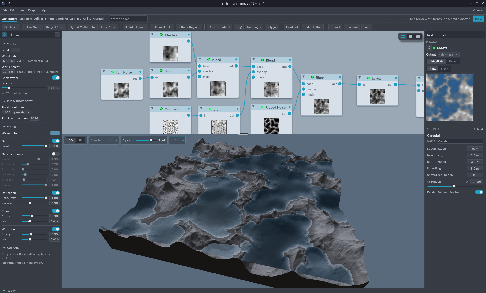

#  Ymir

Ymir is an open-source, node-based procedural terrain generator for Linux and Windows.
Everything in it is a layered field, and every node transforms one. You compose terrain
by wiring small, single-purpose nodes into a graph, where each node reads the fields
coming into it and passes on what it has changed.

It is named for the primordial giant of Norse myth, whose body the world is shaped from.



## Status

Ymir is in early development and is already usable. It has a working node editor, a 3D
terrain viewport, 46 nodes covering noise, shapes, selectors, filters, and three erosion
models, along with subgraphs and export to 16-bit PNG, raw R16, and 32-bit EXR. The
internals are still changing and there are rough edges, so feedback and issues are
welcome.

This is a personal, non-commercial project, held to a high bar: the architecture and the
code should stand up to scrutiny from experienced Rust developers.

## What is inside

A single `Field` type flows on every edge of the graph. A field is a grid of named
scalar layers (`height`, `mask`, `flow`, `water`, `sediment`, and any others a node
cares to create) together with a few scalar globals. Because the engine never needs to
know what a node does with those layers, nodes are insertable anywhere and the graph
imposes no fixed build order.

The node set favours many small operators over a few configurable ones, so a graph's
structure is visible in its wiring. There are generators (fBm, ridged, billow, hybrid,
flow, cellular, and shape primitives), selectors that read height, slope, and curvature,
shapers for curve, levels, invert, blend, warp, and blur, and three erosion models:
thermal, hydraulic, and stream. The full list, with what each node does, is in
[`design/node-inventory.md`](design/node-inventory.md).

The erosion models keep their byproducts. `flow`, `water`, `wear`, and `deposition` all
come back on the field as layers, where downstream nodes and a future texturing stage
can consume them.

Results are reproducible. The same seed and the same graph produce the same terrain on
the same machine, every time. Content-hash memoization and a pinned toolchain make that
possible.

## Building and running

Ymir runs on Linux and Windows. You will need a Rust toolchain via
[rustup](https://rustup.rs), which fetches the pinned compiler version recorded in
`rust-toolchain.toml` automatically, and a GPU with working drivers for the 3D
viewport, since the GUI is built on wgpu: Vulkan on Linux, and Vulkan or DX12 on
Windows. The editor targets both Wayland and X11 on Linux, and building on Windows
also needs the Visual Studio build tools for the MSVC linker.

Released binaries are on the [releases
page](https://github.com/liminalfield/ymir/releases) if you would rather not build:
bare binaries for Linux, and a zip for Windows. The Windows binaries are unsigned, so
SmartScreen warns on first run.

A release build of the whole workspace is the usual starting point:

```bash
cargo build --release
```

The node editor is the `ymir-gui` binary:

```bash
cargo run -p ymir-gui --release
```

The CLI builds a saved project headlessly. The seed, world size, and build resolution
come from the project file, so the result matches what the editor shows:

```bash
cargo run -p ymir-cli --release -- render examples/terraced_beach.ymir --out beach.png
```

With no arguments it renders a built-in sample instead, writing `out/heightmap.png`.

If the build fails on your distribution, please open an issue with the error and the
distro you are on. The exact system packages needed for the Wayland and X11 backends
vary between them. On Windows, a failure at the link step usually means the Visual
Studio build tools are missing.

## Documentation

[`ARCHITECTURE.md`](ARCHITECTURE.md) explains how the engine and the editor fit
together, and [`design/`](design/) holds the design notes behind the data model, the
node taxonomy, erosion, and subgraphs. For the Expression node there is a set of worked
recipes in [`design/expression-cookbook.md`](design/expression-cookbook.md).

## How the work is done

Ymir is written by one maintainer working with an AI coding agent, under a written
brief that both of them follow. The brief is [`CLAUDE.md`](CLAUDE.md), checked into the
repository alongside the code it governs. It sets out the data model, the architectural
invariants, the Rust conventions, and the standard the work is held to, so reading it
tells you the rules this code was written against.

The method is small steps. One component or concept per step, described in plain
language before it is written and summarised after, ending with the tree compiling,
tested, and clean under clippy and fmt. The maintainer reviews each step and is the one
who commits it. Substantive work is filed as a GitHub issue before it starts, and the
commit that lands it names the issue or the pull request it came from. Commits written
with the agent carry a `Co-Authored-By` trailer, so the history records how each change
was produced.

The standards are enforced by machine wherever a machine can do it.
[`scripts/check-shortcuts.sh`](scripts/check-shortcuts.sh) scans the Rust lines a change
adds for the shapes that hide a symptom: a sleep used to dodge a race, `unwrap` or
`panic!` on an expected condition, `#[allow]` over a lint, `todo!`, an ignored test. It
warns on a silently discarded value. The same script runs in the pre-commit hook, in an
agent stop hook, and in CI over the exact range a pull request introduces. A justified
exception is annotated `// shortcut-ok: <reason>` on the line, where review can see it.

CI checks formatting and treats clippy warnings as errors. It builds and tests the
workspace on Linux and Windows, checks the release profile separately from the debug
one, and runs the GPU kernels against a software Vulkan device. It also regenerates the
node reference pages from the registry and fails if the committed pages have drifted,
because a change to user-visible behaviour is finished only when its documentation
changes with it.

None of that can judge whether an approach is correct. That is what the per-step review
is for.

## Contributing

Contributions are welcome. [`CONTRIBUTING.md`](CONTRIBUTING.md) covers how to build,
test, and run the quality gates, and [`CODE_OF_CONDUCT.md`](CODE_OF_CONDUCT.md) sets
out community expectations. The same standards apply to outside changes: a change
leaves the tree compiling, tested, and clippy and fmt clean, and a fix addresses the
cause of a problem at its source.

## License

Ymir is licensed under the GNU General Public License v3.0 only (GPL-3.0-only); see
[`LICENSE`](LICENSE). The bundled IBM Plex fonts are licensed separately under the SIL
Open Font License 1.1, recorded in
[`crates/ymir-gui/assets/fonts/OFL.txt`](crates/ymir-gui/assets/fonts/OFL.txt), and the
vendored `egui-snarl` under `vendor/` is MIT OR Apache-2.0.